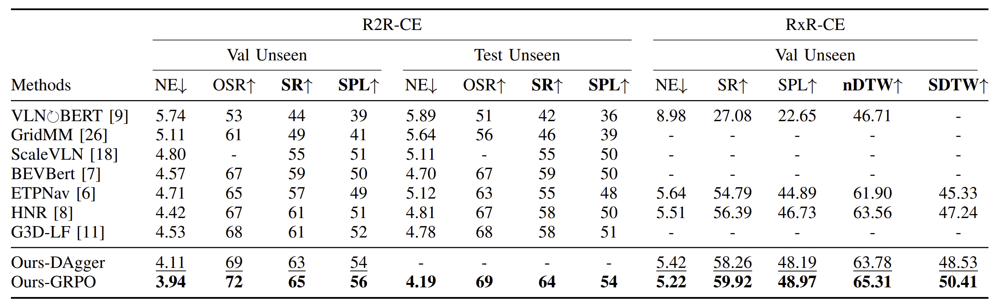

---

# ETP-R1: Evolving Topological Planning with Reinforcement Fine-tuning for Vision-Language Navigation in Continuous Environments

[](https://arxiv.org/abs/2512.20940)

This repository is the official implementation of the paper **"ETP-R1: Evolving Topological Planning with Reinforcement Fine-tuning for Vision-Language Navigation in Continuous Environments"**.

## Introduction

Vision-Language Navigation in Continuous Environments (VLN-CE) requires an embodied agent to navigate towards target in continuous environments, following natural language instructions. While current graph-based methods offer an efficient, structured approach by abstracting the environment into a topological map and simplifying the action space to waypoint selection, they lag behind methods based on Large Vision-Language Models (LVLMs) in leveraging large-scale data and advanced training paradigms.
In this paper, we try to bridge this gap by introducing ETP-R1, a framework that applies the paradigm of scaling up data and Reinforcement Fine-Tuning (RFT) to a graph-based VLN-CE model. To build a strong foundation, we first construct a high-quality, large-scale pretraining dataset using the Gemini API. This dataset consists of diverse, low-hallucination instructions for topological trajectories, providing rich supervision for our graph-based policy to map language to topological paths. This foundation is further strengthened by unifying data from both R2R and RxR tasks for joint pretraining. Building on this, we introduce a three-stage training paradigm, which culminates in the first application of closed-loop, online RFT to a graph-based VLN-CE model, powered by the Group Relative Policy Optimization (GRPO) algorithm. Extensive experiments demonstrate that our approach is highly effective, establishing new state-of-the-art performance across all major metrics on both the R2R-CE and RxR-CE benchmarks.


## Overview

<div align="center">
    
    
</div>


## Installation

### 1. System Requirements
* **Hardware:** We trained our models on a server equipped with **4 NVIDIA A6000 GPUs**. The provided scripts default to using 4 GPUs (`CUDA_VISIBLE_DEVICES=0,1,2,3`).

### 2. Environment Setup

Create the conda environment and install dependencies:

```bash
cd ETP-R1

# 1. Create Conda environment
conda env create -f environment.yaml
conda activate etpr1

# 2. Install PyTorch
pip install torch==1.9.1+cu111 torchvision==0.10.1+cu111 torchaudio==0.9.1 -f https://download.pytorch.org/whl/torch_stable.html

# 3. Install Habitat-Sim (Headless version)
conda install habitat-sim=0.1.7=py3.6_headless_linux_856d4b08c1a2632626bf0d205bf46471a99502b7 headless -c conda-forge -c aihabitat
```

### 3. Install Habitat-Lab

We use a specific version (0.1.7) of Habitat-Lab. Please follow these steps:

1. Download the release: [habitat-lab-0.1.7.zip](https://github.com/facebookresearch/habitat-lab/releases?page=2)
2. Install in develop mode:

    **Note:** The habitat-lab folder does not need to be inside the ETP-R1 project directory. You can unzip and install it from any location on your disk.

```bash
unzip habitat-lab-0.1.7.zip
cd habitat-lab-0.1.7
python setup.py develop --all
```


## Data Preparation

### 1. Matterport3D (MP3D) Dataset

Download the Matterport3D scene dataset. You may need to request access via [Matterport](https://niessner.github.io/Matterport/).

```bash
# Download MP3D data for Habitat
python download_mp.py --task habitat -o data/scene_datasets/mp3d/
```

**Note:**

* After extraction, ensure the file structure follows this format: `data/scene_datasets/mp3d/{scene}/{scene}.glb`.
* There should be **90 scenes** in total.
* Ensure the `scene_datasets` folder is placed inside `data/`.

### 2. Extra Files Setup

We host the necessary extra files (including all datasets, checkpoints, etc.) on Hugging Face. Please visit the link below and download **`extra_files.zip`**:

👉 **Download Link:** [Hugging Face Dataset: ETP-R1-extra-files](https://huggingface.co/datasets/cepillarskeira/ETP-R1-extra-files/tree/main)


After downloading **`extra_files.zip`**, run the following commands:

```bash
unzip extra_files.zip

# Before running the script below, please open `copy_extra_files.py` and modify the `source_root` and `target_root` variables to match your local absolute paths.
python copy_extra_files.py

# Clean up (Optional)
rm -rf extra_files extra_files.zip
```


#### Key Assets Overview

The `extra_files.zip` includes our Gemini-annotated dataset and all trained checkpoints, among other resources.

**1. Checkpoint Hierarchy**

```text
       [Joint Pretraining]
       (Base for all tasks)
                │
        ┌───────┴───────┐
        ▼               ▼
   [R2R SFT]        [RxR SFT]
        │               │
        ▼               ▼
   [R2R RFT]        [RxR RFT]
  (R2R Final)      (RxR Final)

```

**2. Checkpoint Paths**

* **Joint Pretraining:** `pretrained/r2r_rxr_ce/mlm.sap_habitat_depth/store2/model_step_367500.pt`


* **R2R-CE Task:**
* Online SFT: `data/logs/checkpoints/release_r2r_dagger/store/ckpt.iter25000.pth`
* Online RFT (**R2R-CE Final**): `data/logs/checkpoints/release_r2r_grpo/store/ckpt.iter270.pth`


* **RxR-CE Task:**
* Online SFT: `data/logs/checkpoints/release_rxr_dagger/store/ckpt.iter20600.pth`
* Online RFT (**RxR-CE Final**): `data/logs/checkpoints/release_rxr_grpo/store/ckpt.iter1320.pth`


**3. Dataset**

* **Gemini Annotations:** `pretrain_src/datasets/R2R/annotations/pretrain_R2R_RxR/R2R_Prevalent_gemini_aug_enc_xlmr.jsonl`


## Training and Evaluation

We provide scripts for Pretraining, Online SFT, and Online RFT across R2R-CE and RxR-CE tasks.

### 1. Pretraining (Joint R2R + RxR)

Start the pretraining process on the joint dataset:

```bash
CUDA_VISIBLE_DEVICES=0,1,2,3 bash pretrain_src/run_pt/run_mix_server.bash 2333
```

### 2. R2R-CE Benchmark

Run the following commands for Supervised Fine-tuning (SFT), Reinforcement Fine-tuning (RFT), and Evaluation on R2R-CE:

```bash
# Online SFT (DAgger)
CUDA_VISIBLE_DEVICES=0,1,2,3 bash run_r2r/main_server.bash dagger 2333

# Online RFT (GRPO)
CUDA_VISIBLE_DEVICES=0,1,2,3 bash run_r2r/main_server.bash grpo 2333

# Evaluation
CUDA_VISIBLE_DEVICES=0,1,2,3 bash run_r2r/main_server.bash eval 2333
```

### 3. RxR-CE Benchmark

Run the following commands for RxR-CE experiments:

```bash
# Online SFT (DAgger)
CUDA_VISIBLE_DEVICES=0,1,2,3 bash run_rxr/main_server.bash dagger 2333

# Online RFT (GRPO)
CUDA_VISIBLE_DEVICES=0,1,2,3 bash run_rxr/main_server.bash grpo 2333

# Evaluation
CUDA_VISIBLE_DEVICES=0,1,2,3 bash run_rxr/main_server.bash eval 2333
```


## Acknowledgements

Our implementations are partially inspired by [**ETPNav**](https://github.com/MarSaKi/ETPNav).
Thanks for their great works!


## Citation

If you find this work useful for your research, please cite our paper:

```bibtex
@article{ye2025etpr1,
  title={ETP-R1: Evolving Topological Planning with Reinforcement Fine-tuning for Vision-Language Navigation in Continuous Environments},
  author={Ye, Shuhao and Mao, Sitong and Cui, Yuxiang and Yu, Xuan and Zhai, Shichao and Chen, Wen and Zhou, Shunbo and Xiong, Rong and Wang, Yue},
  journal={arXiv preprint arXiv:2512.20940},
  year={2025}
}