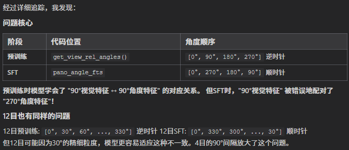
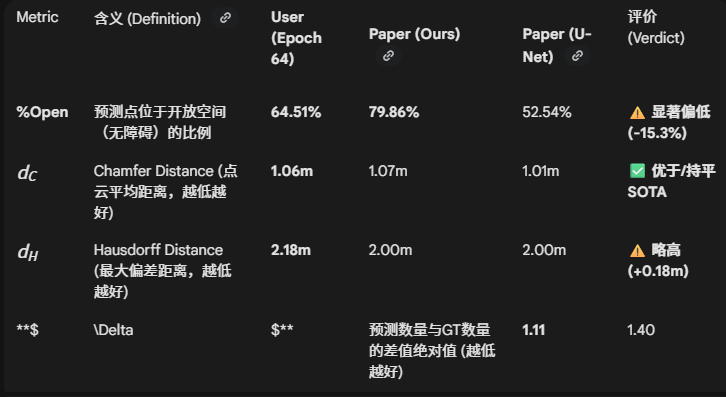

# ETP-R1 项目修改记录

## 2025-12-26: 12目 → 4目相机配置迁移

### 概述
将原有12目相机（12×3=36视角）配置修改为4目相机（4×3=12视角）配置，以适配实际硬件。

---

### 1. 预计算特征提取 (`precompute_img_features/`)

| 文件 | 修改内容 |
|------|----------|
| `save_img.py` | `VIEWPOINT_SIZE`: 36→12, `VFOV`: 60→90, heading增量 1.0→3.0, 仰角切换 %12→%4, `sys.path` 更新 |
| `extract_rgb_features.py` | `VIEWPOINT_SIZE`: 36→12, `batch_size`: 36→12, img_db路径 vfov60→vfov90 |
| `extract_depth_features.py` | `VIEWPOINT_SIZE`: 36→12, `batch_size`: 36→12, img_db路径 vfov60→vfov90 |
| `run.bash` | `PYTHONPATH` 更新为 `/home/wdm/Matterport3DSimulator_copy/build` |

---

### 2. Waypoint Predictor (`waypoint-predictor/`)

| 文件 | 修改内容 |
|------|----------|
| `run_waypoint.bash` | `ANGLES`: 40, `NUM_IMGS`: 4, `BATCH_SIZE`: 32, `CUDA_VISIBLE_DEVICES=0` |
| `image_encoders.py` | ddppo路径更新为 `/home/wdm/ICRA2026_etpnav/data/ddppo-models/` |
| `gen_training_data/get_images_inputs.py` | `NUMBER`: 4, 路径更新 |
| `gen_training_data/get_nav_dict.py` | `NUMBER`: 40, 路径更新 |
| `gen_training_data/test_twm0.2_obstacle_first.py` | `ANGLES`: 40 |

**数据生成完成**: `training_data/rgbd_fov90_4cam/`, `40_*_mp3d_waypoint_*.json`

---

### 3. 预训练代码 (`pretrain_src/pretrain_src_4/`)

| 文件 | 修改内容 |
|------|----------|
| `data/common.py` | `get_view_rel_angles()`: 12 views, 90°增量, 每4视角切换仰角 |
| `data/dataset.py` | `all_point_rel_angles`: range(12), 视角索引 12→4, heading %12→%4, 30°→90°, nav_types 36→12 |
| `run_pt_4/run_mix_server.bash` | 脚本路径更新为 `pretrain_src_4` 和 `run_pt_4`, 输出目录 `r2r_rxr_ce_4cam` |

---

### 4. SFT 训练代码 (`vlnce_baselines/`)

| 文件 | 修改内容 |
|------|----------|
| `waypoint_pred/TRM_net.py` | `num_angles`: 120→40, `num_imgs`: 12→4 |
| `waypoint_pred/utils.py` | `get_attention_mask` 默认参数: 12→4 |
| `utils.py` | 新增 `get_camera_orientations4()` 函数 (90°间隔) |
| `common/utils.py` | 新增 `get_camera_orientations4()` 函数 (90°间隔) |
| `common/base_il_trainer.py` | 导入并使用 `get_camera_orientations4` |
| `models/R1Policy.py` | `pano_img_idxes`: 0-11→0-3, `NUM_ANGLES`: 120→40, `NUM_IMGS`: 12→4 |
| `ss_trainer_ETP_R1.py` | 导入 `get_camera_orientations4`, `cand_idxes`: 12→4, `nav_types`: 12→4 |
| `GRPO_trainer_ETP_R1.py` | 同上 SFT trainer 的修改 |

---

### 关键参数映射

| 参数 | 12目 (原) | 4目 (新) |
|------|-----------|----------|
| 总视角数 | 36 | 12 |
| 每层相机数 | 12 | 4 |
| 水平FOV | 30° | 90° |
| VFOV | 60° | 90° |
| Waypoint ANGLES | 120 | 40 |
| NUM_IMGS (SFT) | 12 | 4 |

---

### 待完成
- [ ] 生成4目预训练特征文件 (CLIP, Depth)
- [ ] 配置 `mix_pretrain_server.json` 中的特征文件路径
- [ ] 训练 Waypoint Predictor
- [ ] 运行预训练
- [ ] 运行 SFT 训练
- [ ] 运行 GRPO 训练

---

## 2025-12-27: 12目 vs 4目 代码对比分析

### 检查结论

经过详细对比 `vlnce_baselines/` (4目) 和 `vlnce_baselines_orin/` (12目) 代码，**主要代码修改已正确完成**。

#### ✅ 已正确修改的部分

| 文件 | 12目 | 4目 | 状态 |
|------|------|-----|------|
| `utils.py` | `get_camera_orientations12()` | `get_camera_orientations4()` | ✅ |
| `ss_trainer_ETP_R1.py` L40 | 导入 `get_camera_orientations12` | 导入 `get_camera_orientations4` | ✅ |
| `ss_trainer_ETP_R1.py` L110 | 调用 `get_camera_orientations12()` | 调用 `get_camera_orientations4()` | ✅ |
| `ss_trainer_ETP_R1.py` L386 | `cand_idxes = np.zeros(12)` | `cand_idxes = np.zeros(4)` | ✅ |
| `ss_trainer_ETP_R1.py` L397 | `nav_types += [0] * (12-np.sum())` | `nav_types += [0] * (4-np.sum())` | ✅ |
| `models/R1Policy.py` L144 | `pano_img_idxes = np.arange(0, 12)` | `pano_img_idxes = np.arange(0, 4)` | ✅ |
| `models/R1Policy.py` L145 | `/12` | `/4` | ✅ |
| `models/R1Policy.py` L179 | `NUM_ANGLES = 120` | `NUM_ANGLES = 40` | ✅ |
| `models/R1Policy.py` L180 | `NUM_IMGS = 12` | `NUM_IMGS = 4` | ✅ |
| `models/R1Policy.py` L258 | `reshape(..., 12, 10, 12)` | `reshape(..., 4, 10, 12)` | ✅ |
| `models/R1Policy.py` L267 | `img_idxes==12` | `img_idxes==4` | ✅ |
| `models/R1Policy.py` L310 | `/120` | `/40` | ✅ |
| `models/R1Policy.py` L316 | `12 - ...` | `4 - ...` | ✅ |
| `models/R1Policy.py` L317 | `img_idxes==12` | `img_idxes==4` | ✅ |
| `waypoint_pred/TRM_net.py` | `num_angles=120, num_imgs=12` | `num_angles=40, num_imgs=4` | ✅ |

---

### ⚠️ 需手动确认的配置项

运行4目SFT训练时，请确保以下配置正确：

#### 1. 预训练权重路径 (`run_r2r/iter_train.yaml`)

当前配置：
```yaml
pretrained_path: pretrained/ETP/mlm.sap_r2r/ckpts/model_step_82500.pt
```

**请修改为4目预训练权重路径**，例如：
```yaml
pretrained_path: pretrained/r2r_rxr_ce_4cam/mlm.sap_habitat_depth/ckpts/model_step_XXXXX.pt
```

#### 2. Waypoint Predictor 权重 (`ss_trainer_ETP_R1.py` L214)

当前硬编码路径：
```python
cwp_fn = 'data/wp_pred/check_cwp_bestdist_hfov90'
```

**请确保此路径指向的是4目训练的waypoint predictor权重**，或修改为新路径。

#### 3. 配置文件 NUM_ANGLES (`run_r2r/iter_train.yaml` L108)

当前配置：
```yaml
MODEL:
  NUM_ANGLES: 12
```

经检查，**此配置项未被代码使用**，`NUM_ANGLES` 在 `R1Policy.py` 中是硬编码的 (`NUM_ANGLES = 40`)，无需修改配置文件。

---

### ✅ 预训练代码分析 (`pretrain_src/pretrain_src_4/mydata/`)

#### common.py - `get_view_rel_angles()`
- **修改正确**: 12 views (4×3), 90° heading increment
- `NUM_VIEWS = 12`, `NUM_CAMERAS = 4`
- Heading: `math.radians(90)` 增量

#### dataset.py - 关键修改点
| 位置 | 12目 | 4目 | 状态 |
|------|------|-----|------|
| L57 | `range(36)` | `range(12)` | ✅ |
| L221 | `viewidx % 12` | `viewidx % 4` | ✅ |
| L222 | `viewidx // 12` | `viewidx // 4` | ✅ |
| L243 | `all_point_rel_angles[12]` | `all_point_rel_angles[4]` | ✅ |
| L247 | `range(36)` | `range(12)` | ✅ |
| L248 | `all_point_rel_angles[12]` | `all_point_rel_angles[4]` | ✅ |
| L276 | `36 - len()` | `12 - len()` | ✅ |
| L493 | `all_point_rel_angles[12]` | `all_point_rel_angles[4]` | ✅ |
| L497-499 | `range(36)` | `range(12)` | ✅ |
| L510 | `36 - len()` | `12 - len()` | ✅ |

**结论**: 预训练代码修改正确，与SFT代码的视图顺序和角度计算保持一致。

---

### 📝 pano_angle_fts 与 pano_rgb 对齐问题

#### 核心问题：什么和什么没有对齐？

**答：`pano_angle_fts`（角度特征）和 `pano_rgb`（视觉特征）没有对齐。**

---

#### 1. pano_rgb 的最终顺序

```python
# R1Policy.py 中的处理流程
# 输入 observations 顺序假设: [0°, 90°, 180°, 270°]

# 第一次重排序 (ra_count逻辑)
a_count=0: ra_count=(4-0)%4=0 → batch[0]=0°
a_count=1: ra_count=(4-1)%4=3 → batch[3]=90°
a_count=2: ra_count=(4-2)%4=2 → batch[2]=180°
a_count=3: ra_count=(4-3)%4=1 → batch[1]=270°
# 结果: [0°, 270°, 180°, 90°]

# 第二次重排序 (torch.flip)
rgb_feats = cat(rgb[:,0:1,:], flip(rgb[:,1:,:], [1]))
# 输入: [0°, 270°, 180°, 90°]
# 输出: [0°] + flip([270°, 180°, 90°]) = [0°, 90°, 180°, 270°]
```

**最终 pano_rgb 顺序: `[0°, 90°, 180°, 270°]` ← 逆时针**

#### 2. pano_angle_fts 的顺序（修复前）

**12目原始代码 (`vlnce_baselines_orin/models/R1Policy.py`):**
```python
self.pano_img_idxes = np.arange(0, 12, dtype=np.int64)
pano_angle_rad_c = (1-self.pano_img_idxes/12) * 2 * math.pi
# 结果: [0°, 330°, 300°, 270°, ..., 30°] ← 顺时针
```

**4目代码（修复前）:**
```python
self.pano_img_idxes = np.arange(0, 4, dtype=np.int64)
pano_angle_rad_c = (1-self.pano_img_idxes/4) * 2 * math.pi

# 计算结果:
idx=0: (1-0/4)*2π = 0°
idx=1: (1-1/4)*2π = 270°
idx=2: (1-2/4)*2π = 180°
idx=3: (1-3/4)*2π = 90°
# 结果: [0°, 270°, 180°, 90°] ← 顺时针
```

#### 3. 对比（修复前）

| 索引 | pano_rgb | pano_angle_fts | 差值 |
|------|----------|----------------|------|
| 0 | 0° | 0° | 0° ✅ |
| 1 | **90°** | **270°** | **180°** ❌ |
| 2 | 180° | 180° | 0° ✅ |
| 3 | **270°** | **90°** | **180°** ❌ |

**索引1和3的视觉特征配了完全相反方向的角度特征！**

---

#### 4. 12目遗留问题

12目用同样的 `(1-idx/N)*2π` 公式，产生**顺时针**角度序列。
12目pano_rgb经过同样处理后是**逆时针**。

**12目也有同样的不一致！** 但角度间隔只有30°，错位后最大差值60°，模型能适应。
4目角度间隔90°，错位后差值180°，无法适应。

#### 5. 修复方案 (已完成 2025-12-27)

**修改 `vlnce_baselines/models/R1Policy.py`:**
```diff
- pano_angle_rad_c = (1-self.pano_img_idxes/4) * 2 * math.pi
+ pano_angle_rad_c = self.pano_img_idxes/4 * 2 * math.pi
# 结果: [0°, 90°, 180°, 270°] ← 与 pano_rgb 一致
```





